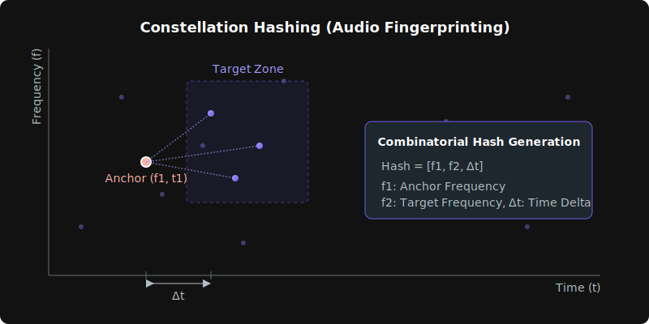
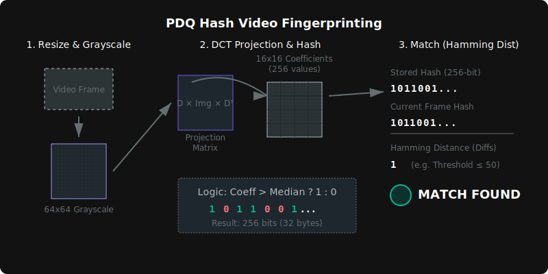

# intro-fingerprint


An MPV script to skip intro sequences in media by fingerprinting audio and video.

When you mark an intro in one episode, the script can search for that same intro in other episodes (using either video or audio matching) and skip it automatically.

# Features

- **Audio Fingerprinting**: Uses Constellation Hashing to find identical audio patterns, robust to noise and distortion. **(Recommended/Default)**
- **Video Fingerprinting**: Uses Gradient Hashing (dHash) to find visually similar intros.
- **High Performance**: 
  - Uses **LuaJIT FFI** for zero-allocation data processing to handle large audio/video datasets efficiently.
  - Optimized **Pure-Lua Fallback** for environments without LuaJIT (e.g., some Linux builds), achieving ~2.5x faster FFTs than standard implementations.
  - Optional **libfftw3** support for accelerated FFT calculations.
- **Async Execution**: Scans run in the background using mpv coroutines and async subprocesses, ensuring the player remains responsive.
- **Cross-Platform**: Supports Windows, Linux, and macOS (with appropriate dependencies).

# Requirements

- **ffmpeg** (required) must be in your system `PATH`. ([Install Instructions](#install-ffmpeg))
- **LuaJIT** (optional) is highly recommended. The script uses FFI C-arrays for audio processing to avoid massive Garbage Collection overhead (standard in mpv). ([Install Instructions](#verifying-luajit-support))
- **'bit' library** (optional): Standard in LuaJIT. Used for faster processing if available.
- **libfftw3** (optional): Provides faster FFT processing for **audio scans only** 
  - Windows, Linux support and *macOS M-series Experimental
  - Pre-built binaries provided in `libs/`, or [build yourself](#building-fftw-libraries).

# Installation
1.  **Download** the ([Latest Release](https://github.com/jjangsangy/intro-fingerprint/releases/latest/download/intro-fingerprint.zip))
2.  **Extract** the contents directly into your mpv configuration directory:
    - **Windows**: `%APPDATA%\Roaming\mpv\`
    - **Linux/macOS**: `~/.config/mpv/`

### (Optional) Enable FFTW
To enable the optimized FFTW paths, edit `script-opts/intro-fingerprint.conf` and set `audio_use_fftw=yes`.

# Usage

1. **Open a video** that contains the intro you want to skip.
2. **Seek** to the very end of the intro.
3. **Press `Ctrl+i`** to save the fingerprint. This captures both video frame and audio spectrogram data to temporary files.
4. **Open another video** (e.g., the next episode).
5. **Press `Ctrl+s`** (Audio scan) or **`Ctrl+Shift+s`** (Video scan) to find and skip the intro.

# Key Bindings

- `Ctrl+i`: **Save Intro**. Captures the current timestamp as the intro fingerprint (saves video frame and audio data to temp files).
- `Ctrl+s`: **Skip Intro (Audio)**. Scans the audio stream for a match based on the saved audio fingerprint.
  - *Note: Audio fingerprinting is significantly faster and is the default method. However, if the intro music changes between episodes while the video remains the same, use Video Skip instead.*
- `Ctrl+Shift+s`: **Skip Intro (Video)**. Scans the current video for a match based on the saved video fingerprint.

## Customizing Key Bindings

You can customize the key bindings using either `intro-fingerprint.conf` file or `input.conf`.

### 1. Using `intro-fingerprint.conf`
You can change the default key bindings by setting the following options in your `intro-fingerprint.conf` file:

```properties
key_save_intro=Ctrl+i
key_skip_audio=Ctrl+s
key_skip_video=Ctrl+Shift+s
```

### 2. Using `input.conf`
You can map any key to the script's named bindings in your `input.conf` file. The internal binding names are:

- `save-intro`
- `skip-intro-audio`
- `skip-intro-video`

**Example `input.conf`:**
```properties
Alt+i script-binding save-intro
Alt+s script-binding skip-intro-audio
Alt+Shift+s script-binding skip-intro-video
```

# Configuration

You can customize the script by creating `intro-fingerprint.conf` in your mpv `script-opts` folder.

## General
| Option  | Default | Description                                                        |
| :------ | :------ | :----------------------------------------------------------------- |
| `debug` | `no`    | Enable console debug printing for performance stats and scan info. |

## Audio Options
| Option                       | Default | Description                                                                 |
| :--------------------------- | :------ | :-------------------------------------------------------------------------- |
| `audio_threshold`            | `10`    | Minimum magnitude for frequency peaks and minimum matches for a valid skip. |
| `audio_min_match_ratio`      | `0.25`  | Minimum ratio of matching hashes required (0.0 - 1.0).                      |
| `audio_concurrency`          | `4`     | Number of parallel FFmpeg workers for audio scanning.                       |
| `audio_scan_limit`           | `900`   | Maximum seconds of the file to scan for audio matches.                      |
| `audio_sample_rate`          | `11025` | Sample rate for audio extraction.                                           |
| `audio_segment_duration`     | `15`    | Duration (seconds) of each audio scan segment for the linear scan.          |
| `audio_fingerprint_duration` | `10`    | Duration (seconds) of the audio fingerprint to capture.                     |
| `audio_fft_size`             | `2048`  | FFT size for audio processing.                                              |
| `audio_hop_size`             | `1024`  | Hop size (overlap) between FFT frames.                                      |
| `audio_target_t_min`         | `10`    | Minimum delay in frames for peak pairs in constellation hashing.            |
| `audio_target_t_max`         | `100`   | Maximum delay in frames for peak pairs in constellation hashing.            |
| `audio_use_fftw`             | `no`    | Use `libfftw3` for faster audio FFT processing.                             |

## Video Options
| Option                    | Default | Description                                                       |
| :------------------------ | :------ | :---------------------------------------------------------------- |
| `video_threshold`         | `12`    | Tolerance for Hamming Distance (0-64). Lower is stricter.         |
| `video_interval`          | `0.20`  | Time interval (seconds) between checked frames during video scan. |
| `video_search_window`     | `10`    | Initial seconds before/after saved timestamp to search.           |
| `video_max_search_window` | `300`   | Maximum seconds to expand the search window.                      |
| `video_window_step`       | `30`    | Step size (seconds) when expanding the video search window.       |

## File Paths
| Option                | Default                       | Description                      |
| :-------------------- | :---------------------------- | :------------------------------- |
| `audio_temp_filename` | `mpv_intro_skipper_audio.dat` | Name of temp file used for audio |
| `video_temp_filename` | `mpv_intro_skipper_video.dat` | Name of temp file used for video |

## Key Bindings
| Option           | Default        | Description                                     |
| :--------------- | :------------- | :---------------------------------------------- |
| `key_save_intro` | `Ctrl+i`       | Key binding to save the intro fingerprint.      |
| `key_skip_video` | `Ctrl+Shift+s` | Key binding to skip using video fingerprinting. |
| `key_skip_audio` | `Ctrl+s`       | Key binding to skip using audio fingerprinting. |

# How it Works

The script uses two primary methods for fingerprinting:

## 1. Audio Fingerprinting (Constellation Hashing)



- **Algorithm**: Extracts audio using FFmpeg (s16le, mono) and performs FFT to identify peak frequencies in time-frequency bins.
- **Hashing**: Pairs peaks to form hashes: `[f1][f2][delta_time]`.
- **Matching**: Uses a **Global Offset Histogram**. Every match calculates $Offset = T_{file} - T_{query}$, and the script looks for the largest cluster (peak) of consistent offsets.
- **Filtering**: Implements **Match Ratio** filtering (default 25%) to ensure the match is an exact fingerprint overlap rather than just similar-sounding music.
- **Search Strategy**: **Concurrent Linear Scan**. The timeline is divided into contiguous segments (e.g., 10s). Each segment is processed by a concurrent worker with sufficient padding to ensure no matches are lost at segment boundaries. Hashes are filtered to prevent double-counting in overlapping regions.
- **Optimization**: 
    - **Concurrency**: Launches multiple parallel FFmpeg workers to utilize all CPU cores.
    - **Inverted Index**: Uses an $O(1)$ hash-map for near-instant lookup of fingerprints during the scan.
    - **Optimal Stopping**: Scans terminate immediately once a high-confidence match is confirmed and the signal gradient drops.

## 2. Video Fingerprinting (Gradient Hash / dHash)



- **Algorithm**: Resizes frames to 9x8 grayscale and compares adjacent pixels: if `P(x+1) > P(x)`, the bit is 1, else 0. This generates a 64-bit hash (8 bytes).
- **Matching**: Uses Hamming Distance (count of differing bits). It is robust against color changes and small aspect ratio variations.
- **Search Strategy**: The search starts around the timestamp of the saved fingerprint and expands outward.
- **Optimization**: FFmpeg video decoding is the most expensive part of the pipeline. By assuming the intro is at a similar location (common in episodic content), we avoid decoding the entire stream, resulting in much faster scans.

# Performance & Technical Details

The script is heavily optimized for LuaJIT and high-performance processing.

## 1. LuaJIT FFI & Memory Management
- **Zero-Allocation Data Processing**: Critical hot paths use **LuaJIT FFI** C-arrays (`double[]`, `int16_t[]`) instead of Lua tables. This prevents massive Garbage Collection (GC) pauses that would occur if creating millions of small table objects for audio samples and hashes.
- **Flattened Data Structures**: 2D data (like spectrogram peaks) is flattened into 1D C-arrays to ensure memory contiguity and cache friendliness.
- **Direct Memory Access**: Raw audio and video buffers from FFmpeg are cast directly to C-structs using FFI, avoiding any copying or string manipulation in Lua.

## 2. Optimized Audio FFT (Custom Implementation)
When `libfftw3` is unavailable, the script falls back to highly optimized internal FFT implementations:

### For LuaJIT (FFI-Optimized)
- **Stockham Auto-Sort Algorithm**: Avoids the expensive bit-reversal permutation step, maximizing FFI performance.
- **Radix-4 & Mixed-Radix**: Processes 4 points at a time to reduce complex multiplications.
- **Cache-Aware Loop Tiling**: Ensures **unit-stride memory access** for maximum memory throughput.

### For Standard Lua (Interpreter-Optimized)
- **Zero-Allocation Processing**: Replaces table churn with reusable buffers to minimize Garbage Collection overhead.
- **Fused Scrambling**: Combines Hann windowing and bit-reversal into a single pass.
- **Precomputed Lookups**: Uses pre-calculated trig tables and bit-reversal maps to avoid redundant math inside hot loops.
- **Speedup**: Achieves approximately **2.5x faster processing** compared to naive Lua implementations.

## 3. Algorithmic Optimizations
- **Inverted Index Matching**: Fingerprints are stored in a hash map ($O(1)$ lookup), allowing the scanner to instantly find potential matches without iterating through the reference data.
- **Precomputed Population Count**: A 256-entry lookup table is used to calculate Hamming distances for video hashes, replacing bit-twiddling loops with a single table lookup per byte.
- **Gradient-Based Early Stopping**: The scanner monitors the "match strength" gradient. Once a peak is found and the signal begins to fade, the scan aborts immediately, saving CPU time.
- **Asynchronous Concurrency**: Uses `mpv` coroutines and multiple parallel FFmpeg workers to utilize all CPU cores without blocking the player UI.

# Install FFmpeg

This script relies on `ffmpeg` being available in your system's `PATH`.

## Windows
Using a package manager (recommended):

**Winget**:
```powershell
winget install ffmpeg
```

**Chocolatey**:
```powershell
choco install ffmpeg
```

**Scoop**:
```powershell
scoop install ffmpeg
```

## macOS
Using Homebrew:
```bash
brew install ffmpeg
```

## Linux
**Debian/Ubuntu**:
```bash
sudo apt update && sudo apt install ffmpeg
```

**Fedora**:
```bash
sudo dnf install ffmpeg
```

**Arch Linux**:
```bash
sudo pacman -S ffmpeg
```
# Troubleshooting

- **"FFmpeg failed during scan"**: Ensure `ffmpeg` is in your system PATH and accessible by mpv.
- **No match found**: 
  - For Video: Try increasing `video_threshold` or ensure the intro is visually similar.
  - For Audio: Ensure the intro has consistent music/audio.
- **Slow Scans**: Enable `audio_use_fftw` and ensure you are using LuaJIT. See [Verifying LuaJIT Support](#verifying-luajit-support) below.

## Verifying LuaJIT Support

This script is highly optimized for **LuaJIT**. While it includes a fallback for standard Lua (5.1/5.2), using LuaJIT provides significantly faster performance, especially for audio scanning.

To check if your mpv build uses LuaJIT, run the following command in your terminal:

**Windows**:
```powershell
mpv -v --no-config null:// 2>&1 | findstr luajit
```

**macOS / Linux**:
```bash
mpv -v --no-config null:// 2>&1 | grep luajit
```

If the command returns a line containing `luajit`, you are good to go. If it returns nothing, you are likely using standard Lua.

**If `luajit` is missing:**

-   **Windows**: Download the official builds from [mpv.io](https://mpv.io/installation/) (e.g., shinchiro builds). These include LuaJIT by default.
-   **macOS**: Install via Homebrew: `brew install mpv`.
-   **Linux**:
    -   Some distribution packages (Ubuntu/Debian) ship with standard Lua instead of LuaJIT.
    -   **Recommended**: Install via **Flatpak** from [Flathub](https://flathub.org/apps/io.mpv.Mpv), which includes LuaJIT.

# Building FFTW Libraries

The project includes a `Dockerfile` for building the required shared libraries:
- `libfftw3f.so` (Linux)
- `libfftw3f-3.dll` (Windows)
- `libfftw3f.dylib` (macOS M-series ARM64 - **Experimental**)

```bash
docker build --output type=local,dest=. .
```

This will populate the `libs/` directory with the appropriate binaries.

# Development & Testing
You can use the provided VS Code DevContainer to test the script in a pre-configured Linux environment:
1. Open the project in VS Code.
2. Click **Reopen in Container** when prompted.
3. The container comes with `mpv`, `ffmpeg`, and `xvfb` pre-installed.
4. To test headlessly: `xvfb-run mpv --script=main.lua videos`
   - *Note: Place your test videos in the `videos/` folder in the project root to have them available inside the container.*

# License

MIT
