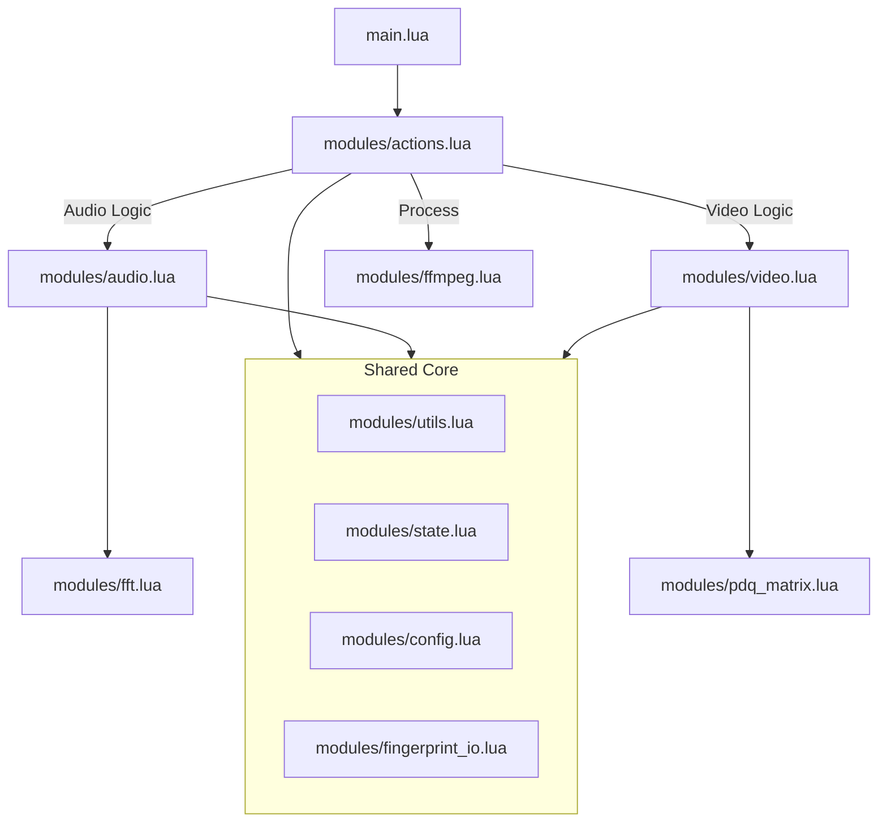

# System Patterns

## Architecture Overview
The system follows a strict modular design pattern. `main.lua` serves only as the entry point and orchestrator, delegating all logic to specialized modules in `modules/`.

### Module Responsibilities
- **`actions.lua`**: High-level workflow (Capture -> Save, Scan -> Match -> Skip).
- **`audio.lua`**: Constellation hashing, peak detection, spectral analysis.
- **`video.lua`**: PDQ hashing, frame validation, Hamming distance calculation.
- **`ffmpeg.lua`**: Profile-based command builder for sync/async execution.
- **`fft.lua`**: Dual-path FFT implementation (Stockham FFI / Cooley-Tukey Lua).
- **`pdq_matrix.lua`**: Generates the DCT matrix for PDQ hashing.
- **`fingerprint_io.lua`**: Handles reading/writing fingerprint data to disk.
- **`config.lua`**: Manages configuration options and user overrides.
- **`state.lua`**: Manages global scanning state and async tokens.
- **`sys.lua`**: System operations (directory creation, path resolution).
- **`ui.lua`**: Manages OSD (On-Screen Display) messaging.
- **`utils.lua`**: FFI loading, async coroutines, system logging.

## Core Algorithms

### 1. Audio: Constellation Hashing
Robust against noise and distortion. Matches patterns in the frequency domain.

1.  **Extraction**: Extract mono s16le PCM @ 11025Hz.
2.  **Normalization**: Apply `dynaudnorm` filter to ensure volume invariance.
3.  **Spectrogram**:
    *   Apply Hann window.
    *   Compute FFT (2048 bins) using **Stockham Auto-Sort** (FFI) or **Optimized Cooley-Tukey** (Lua).
    *   Extract Squared Magnitudes (avoiding expensive `sqrt`).
4.  **Peak Detection**: Identify local maxima (top 5 peaks per frame).
5.  **Hashing**: Form "Constellation Pairs" $[f1, f2, \Delta t]$.
    *   *Anchor Point*: $f1$ at time $t$.
    *   *Target Zone*: Look ahead $\Delta t$ frames for peak $f2$.
    *   *Hash*: `(f1 << 23) | (f2 << 14) | delta_t`.
6.  **Matching (Global Offset Histogram)**:
    *   Calculate $Offset = T_{file} - T_{fingerprint}$ for every matching hash.
    *   Bin the offsets. A true match creates a large spike at a single offset.
    *   **Neighbor Bin Summing**: Sum counts of adjacent bins $(b_{i-1} + b_i + b_{i+1})$ to account for timing jitter.

### 2. Video: PDQ Hash (Perceptual)
Robust against scaling, cropping, and compression. Uses gradients to identify content.

1.  **Preprocessing (Jarosz Filter Approximation)**:
    *   Scale to `512x512` (Bilinear).
    *   Convert to Grayscale (Rec.601).
    *   Blur: `avgblur=4x4` (Pass 1) -> `avgblur=4x4` (Pass 2) -> Approximates Tent filter.
    *   Decimate to `64x64`.
2.  **DCT Projection**:
    *   Compute specific `16x16` low-frequency coefficients directly from the `64x64` input.
    *   Uses **Matrix Multiplication**: $DCT \times Image \times DCT^T$.
    *   Optimized FFI path uses contiguous C-arrays; Lua path uses flat tables and loop unrolling.
3.  **Hashing**:
    *   Calculate Median of the 256 coefficients.
    *   Bit $i = 1$ if $Coeff_i > Median$, else $0$.
    *   Result: 256-bit (32-byte) hash.
4.  **Quality Validation**:
    *   Reject flat/featureless frames using **Gradient Sum** metric (PDQ standard).
    *   Reject extreme brightness/darkness or low entropy.
5.  **Matching**:
    *   Calculate Hamming Distance (bit differences).
    *   Threshold $\le 50$ indicates a match.

## Performance Patterns

### Concurrent Scanning
- **Audio**: Splits the search range into segments (e.g., 15s). Spawns multiple FFmpeg workers (default 4) to process segments in parallel.
- **Ordered Consumption**: Main thread consumes worker results in order to support **Early Stopping**.

### Early Stopping
- Monitors the "match strength" gradient.
- If a high-confidence match is found and the signal subsequently drops (indicating the end of the match region), the scan aborts immediately.

### Memory Management
- **Zero-Allocation (FFI)**: Reuses pre-allocated C-buffers for FFT and image processing to prevent GC pauses.
- **Cleanup**: Listens for `end-file` event to `abort_async_command` on any running workers, preventing zombie processes.
