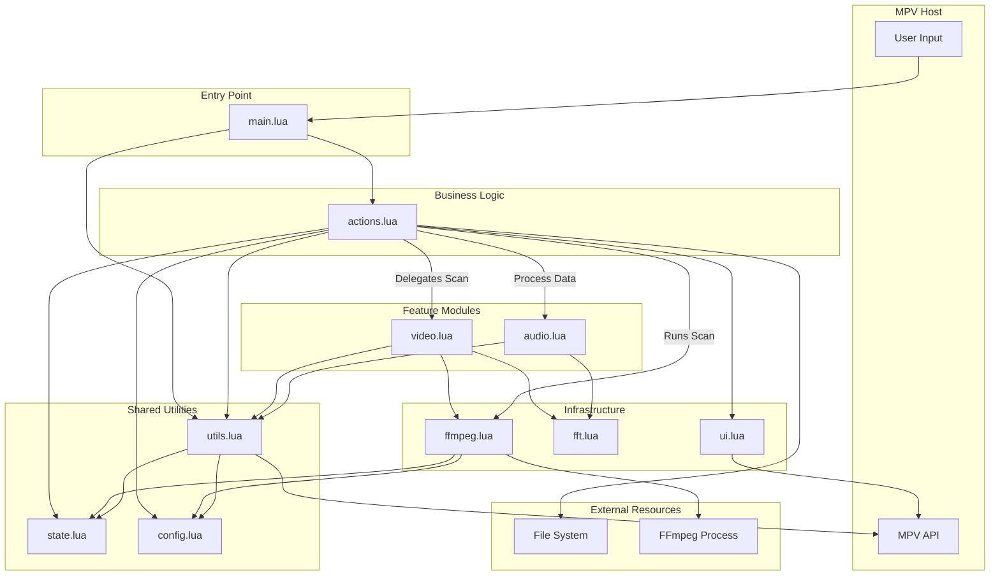

# System Patterns

## Architecture Overview
The script uses a modular architecture where `main.lua` acts as the orchestrator, requiring specialized modules from the `modules/` directory. All architectural standards and coding best practices are strictly enforced as defined in `.clinerules/mpv-lua-practices.md`. It relies on external processes (`ffmpeg`) for decoding and internal FFI logic for data processing.

## Module Responsibilities

| Module | Description |
| :--- | :--- |
| `main.lua` | Script entry point. Registers event listeners (e.g., `end-file` for cleanup) and binds user keys. |
| `modules/config.lua` | Centralized configuration management. Defines default options and loads overrides via `mp.options`. |
| `modules/actions.lua` | High-level business logic. Orchestrates fingerprint capture (`save_intro`) and asynchronous scanning (`skip_intro_video`, `skip_intro_audio`). |
| `modules/ffmpeg.lua` | FFmpeg command wrapper. Abstractly manages command profiles, construction, and sync/async execution. |
| `modules/utils.lua` | Common utility functions. Handles FFI loading with fallbacks, async coroutine management, and path generation. |
| `modules/ui.lua` | Simple abstraction for User Interface feedback via MPV's OSD. |
| `modules/state.lua` | Encapsulates shared runtime state (e.g., `scanning` flag) to prevent race conditions and manage task cancellation. |
| `modules/video.lua` | Implements video pHash calculation and segment scanning logic. |
| `modules/audio.lua` | Implements audio constellation hashing, peak detection, and Global Offset Histogram matching. |
| `modules/fft.lua` | Core FFT library providing both optimized Stockham (FFI) and Cooley-Tukey (Lua) implementations. |

## Key Algorithms

### 1. Video Fingerprinting: Perceptual Hash (pHash)
- **Extraction**: Resizes frame to 32x32 grayscale using FFmpeg `vf=scale=32:32,format=gray`.
- **Validation**: Rejects low-quality frames to prevent hash collisions.
    - **Stage 1 (Spatial)**: Checks for Variance (StdDev < 10), Histogram Peak (> 70%), and Edge Density (< 1.5%).
    - **Stage 2 (DCT)**: Checks for AC/DC Energy Ratio (< 10%) and pHash Region Variance (< 50).
- **Hashing**: 
    - **DCT-II**: Computes the Discrete Cosine Transform of the 32x32 image.
        - **Standard Logic**: Uses Makhoul's method (FFT-based DCT) via FFI using the optimized internal Stockham implementation.
        - **Optimized Lua Fallback**: Uses a **Partial Direct DCT** (matrix multiplication) for the pure Lua path. This computes only the first 8 coefficients for each row and column, avoiding unnecessary calculations and complex-number overhead.
    - **Feature Extraction**: Extracts the 8x8 low-frequency coefficients (excluding the DC component).
    - **Thresholding**: Compares each coefficient to the mean of all 64 coefficients to generate bits.
- **Result**: A 64-bit integer (8 bytes).
- **Matching**: Hamming distance. A distance $\le 12$ (configurable) is considered a match.
- **Search Strategy**: Sliding window centered on the original timestamp, expanding outwards to balance speed and accuracy.

### 2. Audio Fingerprinting: Constellation Hashing
- **Extraction**: FFmpeg extracts raw PCM (`s16le`, mono, 11025Hz).
- **Normalization**: Applies mandatory `dynaudnorm` filter (default settings) to the audio stream. This ensures consistent spectral peaks regardless of source volume or original mixing, making the algorithm volume-invariant with minimal performance overhead.
- **Processing**:
    - FFT:
        - **LuaJIT FFI (Primary)**: FFI-optimized Stockham Radix-4 & Mixed-Radix implementation. Provides high-performance FFT processing.
        - **Standard Lua (Fallback)**: Uses an optimized in-place Cooley-Tukey implementation with precomputed trig tables and bit-reversal caches to minimize GC overhead.
    - Peak detection identifies the most prominent frequencies (top 5 per frame).
- **Hashing**: Pairs of peaks $[f1, f2, \Delta t]$ are combined into a unique 32-bit hash.
- **Inverted Index**: Saved fingerprints are indexed by hash for $O(1)$ lookup during scans.
- **Matching**:
    - **Global Offset Histogram**: For every match, $Offset = T_{long\_file} - T_{query}$ is calculated. A true match produces a massive "cluster" at the same offset.
    - **Neighbor Bin Summing**: To handle timing jitter and "bin splitting," the script sums the counts of three adjacent time bins ($bin_{i-1} + bin_{i} + bin_{i+1}$) when calculating match strength. This ensures robustness against minor alignment variations.
    - **Match Ratio**: Skips require a minimum percentage of intro hashes to be present (default 30%) to filter false positives from similar music. The ratio is calculated based on the summed neighbor peaks.
- **Search Strategy**: **Concurrent Linear Scan**. The timeline is divided into contiguous segments (default 15s). Each segment is processed by a concurrent worker with sufficient padding to ensure no matches are lost at segment boundaries. Hashes are filtered to prevent double-counting in overlapping regions.

## Performance Patterns
- **Concurrent Worker Pool**: Audio scanning uses multiple parallel FFmpeg subprocesses (configurable via `audio_concurrency`) to maximize CPU utilization.
- **Ordered Result Processing**: Asynchronous workers pipe results into a buffer that is processed in chronological order to maintain gradient-based early stopping.
- **Gradient-Based Early Stopping**: Scans terminate immediately after a high-confidence match is detected and the match strength subsequently drops.
- **LuaJIT FFI**: Critical for peak performance. Uses C-structs and arrays to avoid Lua garbage collection overhead when handling millions of data points.
- **Zero-Allocation Fallback**: Standard Lua path uses pre-allocated buffers and lookup tables for FFT to achieve ~2.5x speedup over naive implementations, ensuring usability on builds without LuaJIT.
- **Async Subprocesses**: `mp.command_native_async` and coroutines ensure the MPV interface remains responsive during scans.

## Lifecycle Management
- **Scan Abortion**: To prevent race conditions and orphan processes, the script listens for the `end-file` event. It uses `mp.abort_async_command` with a stored `current_scan_token` to immediately terminate any running FFmpeg workers and reset the `scanning` state.

## Data Flow
1. **User Input** (Keybind) $\rightarrow$ **MPV Command**
2. **FFmpeg Subprocess** $\rightarrow$ **Raw Data Pipe (stdout)**
3. **FFI Logic** $\rightarrow$ **Hash Generation & Matching**
4. **MPV Property Set** (`time-pos`) $\rightarrow$ **Seek**
